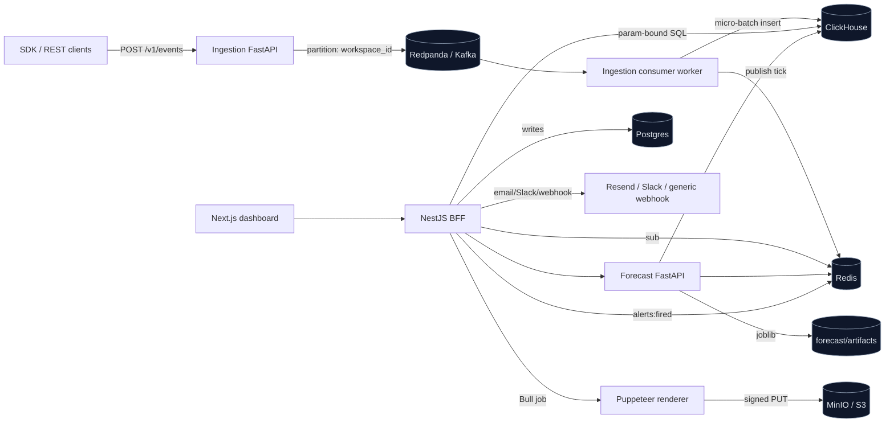

# Architecture

InsightFlow is a self-hostable real-time BI platform. This document explains
the system's shape at the level a new contributor or a reviewer can hold in
their head after five minutes.

## Service responsibilities

| Service | Stack | What it owns |
|---|---|---|
| `ingestion` | Python 3.11 + FastAPI + aiokafka | `/v1/events`, rate limit, Kafka producer; separate consumer process drains `events.raw` → ClickHouse |
| `forecast` | Python 3.11 + FastAPI + Prophet + pmdarima | `/forecast`, `/anomaly`, `/retrain`, joblib model registry |
| `api` (BFF) | NestJS 10 + Prisma | Auth, workspaces, dashboards, alerts, PDF jobs, share links, WebSocket fan-out |
| `frontend` | Next.js 14 + Tailwind + React Query | Dashboard UI, widgets, alerts/models pages, public share page |
| `clickhouse` | ClickHouse 24 | Event store + KPI/cohort materialised views |
| `postgres` | Postgres 16 | Identity, tenancy, dashboards, widgets, alerts, share links, pdf jobs |
| `redis` | Redis 7 | KPI cache (5s), cohort/funnel cache (60s), forecast cache (24h), Socket.IO pub/sub, BullMQ |
| `redpanda` | Redpanda (Kafka-compatible) | `events.raw`, `events.tick`, `alerts.fired` topics |
| `minio` | MinIO | S3-compatible bucket for PDF exports |
| `caddy` | Caddy 2 | TLS, edge rate limits, reverse proxy |

## Write path (events)

1. Client SDK posts to `ingestion`. The Pydantic schema rejects nested
   properties and over-long fields. API-key auth is enforced before any
   payload work — keys are stored in Postgres but the ingest service reads
   them via asyncpg so it stays online when the BFF is restarting.
2. `ingestion` produces to Kafka topic `events.raw` with partition key
   `workspace_id` (per-tenant ordering preserved).
3. The consumer worker pulls in batches up to 1000 rows or 1 second,
   enriches with geo (MaxMind, fail-open) and UA (ua-parser), and inserts
   into the `events` table via `clickhouse-connect`. ReplacingMergeTree on
   `(workspace_id, event_id)` absorbs Kafka redeliveries.
4. ClickHouse materialised views (`mv_kpi_hourly`, `mv_cohort_daily`) keep
   pre-aggregated tables updated in the same transaction.

## Read path (dashboards)

1. Frontend asks the BFF for a dashboard. Every ClickHouse query routes
   through `withWorkspace(workspaceId, fn)` — a runtime check enforces
   `workspace_id = {workspace_id:UUID}` is present in the SQL and the
   parameter is injected by the wrapper, not the caller (ADR-005 +
   `api/src/common/with-workspace.ts`).
2. KPI tiles hit `kpi_hourly` with merge-aggregates and a 5 s Redis cache.
3. Forecast tiles call the forecast service via the BFF wrapper — the
   forecast service loads the latest joblib artifact for the
   `(workspace_id, metric)` pair from the registry, returns a 24 h-cached
   band.
4. Live updates come from Socket.IO — the BFF subscribes to
   `metrics:tick:<workspace_id>` on Redis; the ingestion consumer publishes
   one tick per workspace every 5 seconds (never raw events to the
   browser).

## Tenant isolation

Row-level by `workspace_id` as the first ORDER BY column in every
ClickHouse table (`docs/ADR-005-multitenant-row-level.md`). Application-layer
enforcement is the single `withWorkspace()` helper. Cross-tenant reads are
verified empty by integration tests in `api/src/common/with-workspace.spec.ts`.

## ML pipeline

- Nightly cron at 02:00 UTC fires `.github/workflows/retrain.yml` which
  POSTs `/retrain` on the forecast service with `X-Retrain-Secret`.
- `/retrain` enumerates `(workspace, metric)` pairs (workspaces with any
  events in the last 90 days × the static `METRICS` allowlist) and runs
  Prophet + ARIMA on each pair in an executor pool. Failures are per-pair
  warnings; the run as a whole still returns 200.
- Models are persisted as joblib artifacts under
  `forecast/artifacts/{workspace}/{metric}/{kind}__{ts}.pkl` with a
  SHA-256 manifest. `registry.load()` refuses tampered files.
- The model card page (`/models`) reads `GET /forecast/models` and renders
  Prophet vs ARIMA MAPE side-by-side on the 14-day holdout split.

## Alert pipeline

- `@nestjs/schedule` cron runs every 5 minutes inside the BFF.
- For each enabled alert: POST `/anomaly` on the forecast service with the
  alert's method (z-score | iqr) and threshold params. If the most recent
  point is flagged AND `last_fired_at` is older than `cooldown_seconds`,
  the BFF:
  - INSERTs an `alert_events` row,
  - UPDATEs `alert.last_fired_at`,
  - publishes to Redis `alerts:fired:<workspace_id>` (Socket.IO fan-out),
  - fans out to configured channels (Resend email, Slack webhook, generic
    webhook with `x-insightflow-signature` HMAC).

## What's NOT in v1

- SQL editor / ad-hoc query UI
- Custom-metric DSL (metrics live in a frozen allowlist)
- BYO-warehouse adapters
- RBAC beyond owner / member / viewer
- A/B test analysis
- Session replay

Tracked under "v2" in `todo.md`.
